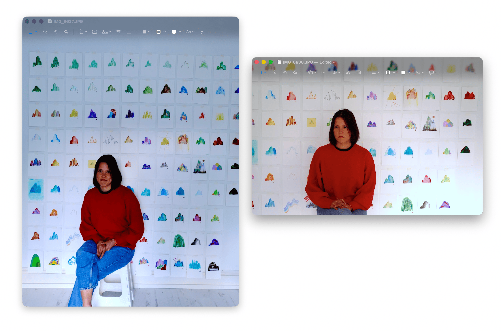

**100 Days, 100 Mountains** is my meditative practice, grounded in repetition.

Every mountain drawn feels like a single step forward.

It is now day 122, and I am still making mountains.

As of 15 March, I've drawn 22.
As of 22 April, I've drawn 59.
As of 12 May, I've drawn 79.
As of 4 June, I've drawn 102.

Maybe I'll make 100 more. Maybe I'll make 1000.

_A few photos, from June 2026. Photos by David Littlejohn-Carrillo._