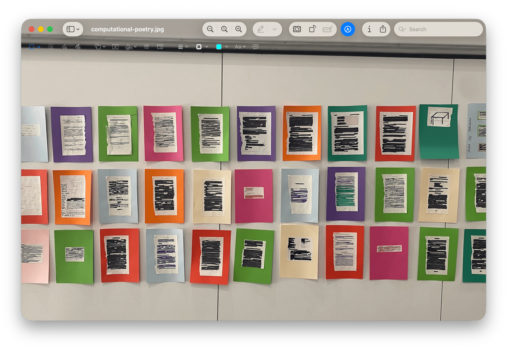

**Computational Poetry 101** is a workshop about computational poetry.

The first iteration of this workshop used two textbooks: "How to program C++ by H.M. & P.J. Deitel" and "In Code: a Mathematical Journey" by Sarah Flannery.

This workshop was debuted at the Collaborations Workshop in 2026.

