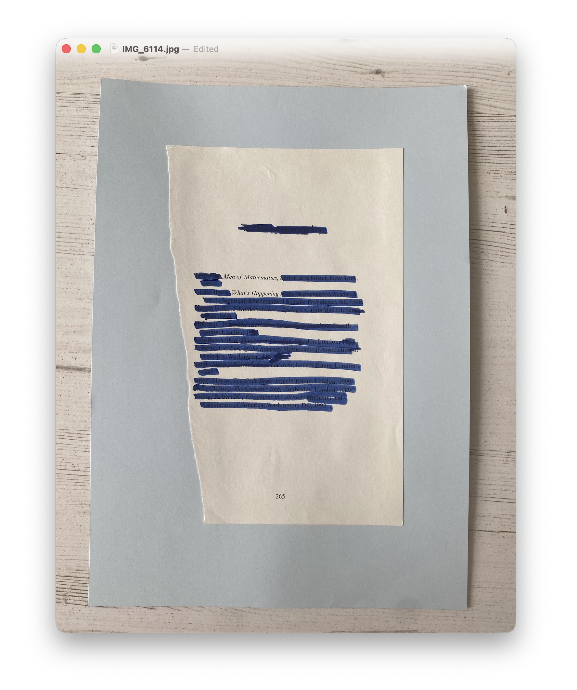

**Computational Poetry 101** is a workshop about computational poetry, using analogue tools.

Participants created [blackout poetry](https://en.wikipedia.org/wiki/Blackout_poetry), as defined by the following: 
> **Blackout poetry**, or **erasure poetry**, is a form of [found poetry](https://en.wikipedia.org/wiki/Found_poetry "Found poetry") or [found object](https://en.wikipedia.org/wiki/Found_object "Found object") art created by erasing words from an existing text in [prose](https://en.wikipedia.org/wiki/Prose "Prose") or [verse](https://en.wikipedia.org/wiki/Poetry "Poetry") and framing the result on the page as a [poem](https://en.wikipedia.org/wiki/Poem "Poem").

Participants in the audience were primarily Research Software Engineers, or people who work with technology on the daily basis. After introducing the notion of poetic computation, or rather, computation not for a *utility* but as an intuitive or aesthetic act... They each were given a black marker, then encourage to see what emerged from the pages of a book.

The first iteration of this workshop used two textbooks that I grabbed from a charity shop: "How to program C++ by H.M. & P.J. Deitel" and "In Code: a Mathematical Journey" by Sarah Flannery, an Irish mathematician. 

It was interesting to see how the engineers responded to the workshop, as they asked questions the purpose of poetic thinking, which might take them in directions that aren't seen of as 'productive', especially in a time-pressed environment.

But in any case, I love this description of what blackout poetry _does_, written by [Claire McNerney](https://writingcooperative.com/an-introduction-to-blackout-poetry-e7046c50ab52):
> Blackout poetry can be revolutionary because it allows the poet to reshape the language of whatever text they want. By using blackout poetry on an oppressive or outdated text, the poet can use the words of that text to reinvent the world, creating instead a text that they prefer. It’s almost utopian in the sense that the new poem can push itself into the ideal.

This workshop was first organised for Collaborations Workshop in 2026 via the presentation: ["Poetic Computing 101"](https://zenodo.org/records/19884891). I'd love to do it again!

